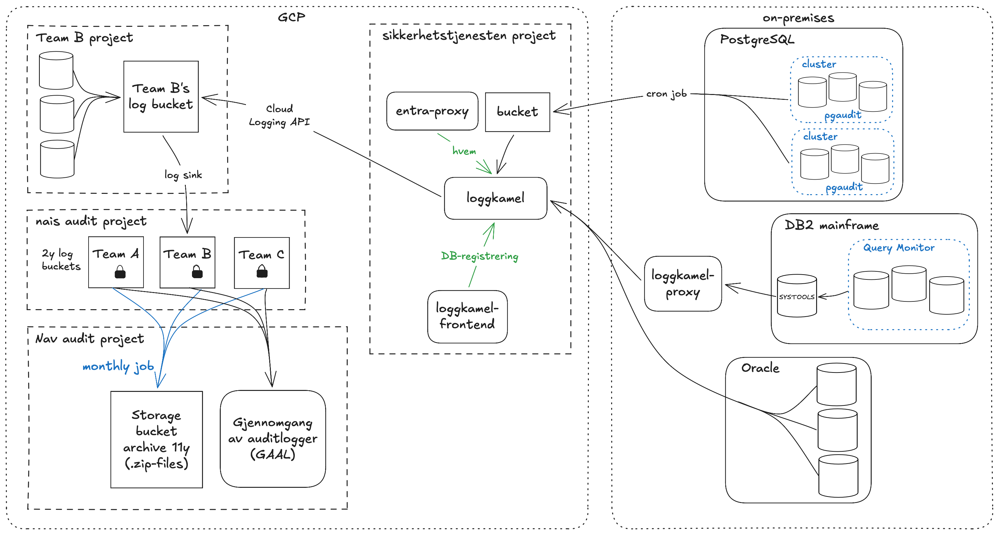

# Loggkamel

Loggkamel overfører logger fra on-prem databaser til GCP.
Generert med [Kameleon](https://kameleon.dev).

[Roadmap på Confluence](https://confluence.adeo.no/spaces/TM/pages/809435585/Loggkamel+roadmap)

Slackkanal:
[#team-sikkerhetstjenesten](https://nav-it.slack.com/archives/C09KKNS0RJS)

## Usage (for other teams)

In order for Loggkamel to transfer/archive audit logs from an on-prem database to the Nais audit log archive, the following is required:
* For push model technologies: Database logs must be sent to the appropriate destination bucket in GCP
  * PostgreSQL
* For pull model technologies: Loggkamel must have read access to the appropriate database(s), configured through loggkamel-proxy
  * Oracle
  * DB2
* A corresponding Arkiv task must be configured via the AuditloggArkivController, which is intended to be accessed via a frontend in TBD. For now, sikkerhetstjenesten team can configure that for you
* The Arkiv task must have at least one of the applicable flags be true:
  * okonomi for [økonomireglementet 4.3.6](https://www.regjeringen.no/globalassets/upload/fin/vedlegg/okstyring/reglement_for_okonomistyring_i_staten.pdf),
  * arkivlov for [arkivforskrifta §5](https://lovdata.no/nav/forskrift/2025-12-17-2647/), and/or
  * loggingLeseoperasjoner if SELECT logs needs to be archived for e.g. personvernshensyn.
* The flag "fiksa" asserts whether all configuration needed is completed
  * Postgres tasks will have this flag set to "true" by default, since no additional configuration is needed from project owners
  * For some pull model technologies this flag will be false initially, until configuration is done by that team to ensure loggkamel-proxy has read access to the DB files
    * TODO: elaborate on once pull model technologies are implemented

## AuditloggArkiv Controller (TBD)

The AuditloggArkiv controller is intended to be used via an integrated frontend in TBD. It allows a new Arkiv task to
be created for a given database and owning naisteam (the combination of these two values must be unique), or an existing
Arkiv task to be updated. The controller also allows for retrieval of all Arkiv tasks for a given Naisteam.

### Swagger

DEV: https://loggkamel.intern.dev.nav.no/swagger-ui/index.html#/

PROD: https://loggkamel.intern.nav.no/swagger-ui/index.html#/

## Program design and intent




The log archiving process goes through the following steps:

### Ingress

Ingress is based on a push model for technologies where this is possible, and a pull model for ones where it is not.
For push-based technologies, DBAs will be responsible for pushing logs to the appropriate GCP bucket. For pull-based
technologies, Loggkamel will be responsible for pulling logs from the relevant database via loggkamel-proxy. In this step the logs are
decompressed if necessary, and represented as a String containing one or more log lines.

Consumers are configured to delete the source file from GCP only once processing is successful, whether that be moving forward
or sending a file to a backout queue. This enforces transactional behavior.

Consumers are configured to use an idempotent consumer pattern, to avoid multiple simultaneous processes when multiple instances
of Loggkamel are running in DEV or PROD. This behavior is implemented via a database table that tracks already processed files,
and is cleaned regularly to avoid unbounded growth.

Consumers are configured to use a feature flag, allowing for per-consumer control in DEV and PROD. Consumer routes start disabled
but will be enabled within a minute of startup if their flags are set to true. This can be managed in [Unleash](https://sikkerhetstjenesten-unleash-web.iap.nav.cloud.nais.io).

#### Postgres

Push-based, we expect logs to be .gz files that are the output of pgAudit. Filenames are expected
to be of the form:

`<database_name>.<publish_date>.auditlog[.gz]`

### LogStream Enrichment

Database name is extracted from the filename, and it along with the producing technology is used to find the relevant 
Arkiv task, Naisteam that owns the arkiv task, and GCP Project ID for the owning team. This routing information is added
to the message header for use in later steps.

### LogStream Filtering

For cases where a LogStream corresponds to a backup task that is not yet configured, or that has no applicable legal arkiv
requirements, processing of the LogStream is stopped at this step and the LogStream is discarded.

### Splitting

LogStreams containing multiple log lines are split into packets of up to 1000 individual log lines. Log names are updated to be unique for
each log packet. Each line within a packet is numbered to allow for unique identification of lines in logs (unique log packet name + line number).

### LogPacket Bucket

Log packets are stored as individual files in a GCP bucket, consisting of a list of objects with the log line body as a string and
routing information as a header. This is done to allow for breaking down very large files into ones small enough to fit in memory,
and to minimize how long a given file is in-flight. LogPacket files share a common format across technologies,
though the log line body format may differ based on the producing technology and log type.

### LogPacket Splitting

Once a log packet is consumed, it is split into individual log lines which are then processed individually. Failure of any line
within a packet will result in the entire packet being sent to a backout queue.

### LogLine Enrichment

Log line bodies are parsed to extract relevant information, and external requests are made as needed to get information
about the user that performed the operation being logged.

### LogLine Filtering

If the log line corresponds to an operation that is not relevant for the archiving requirements for this database, the log
line is discarded at this step.

### Publishing

Log lines that are relevant for archiving are published to the default log bucket of the owning team's GCP project.
The Loggkamel IAM user must have "Log Writer" permissions in the owning team's GCP project for this to work. This is granted
by default via NAIS team configuration.

## Backout Queues

Log files that fail processing are sent to a backout queue specific to the technology that produced the log, so that
they may be redriven by being moved back to the consumer directory. Failures stemming from dependencies are retried
several times first.

## Graceful Termination

Graceful termination is handled by default Spring Boot behavior. On receiving a shutdown signal individual routes will
finish their current message processing before shutting down, and no new messages will be taken in. Messages are only
removed from the origin queue once processing is complete, so no messages will be lost. If the service shuts down
abruptly, the message will not be removed from the origin queue and will be processed by another instance of loggkamel
after the lock on it has expired. GCP log clients are flushed on shutdown to ensure that all messages are sent before the service exits.

## Kjøre lokalt (for development)

Applikasjonen er satt opp til a bruke en PostgreSQL proxy i `local`-profilen, det bruker den DEV Loggkamel DB.

### Kjøre lokal proxy mot dev DB (anbefalt)

Start your local proxy with:

```zsh
nais postgres proxy --team sikkerhetstjenesten --environment dev-gcp --reason "debugging issue" loggkamel
```

Standard lokal JDBC-url er:

- `jdbc:postgresql://localhost:5432/loggkamel?user=YOUR.USERNAME@nav.no`

Brukernavn settes via miljo-variabel (ikke hardkodet i URL), heller manuelt eller i IDE run configuration:

```zsh
export LOCAL_DB_USERNAME="$(whoami)@nav.no"
mvn spring-boot:run -Dspring-boot.run.profiles=local
```

Hvis du trenger a overstyre URL:

```zsh
export LOCAL_DB_JDBC_URL="jdbc:postgresql://localhost:5432/loggkamel"
```

### Log file input and output

For push-based technologies, files must be placed into resources/files/TECHNOLOGY directories for loggkamel to find them.
Intermediate LogLine files will be placed in resources/files/intermediate. Invalid message queues are
represented by directories that are created under these consumer as needed. A log file can be redriven by being copied
back into the consumer directory, either technology-specific for LogGroups or "intermediate" for LogLines. If redriving
a file multiple times in close succession, ensure that the file is removed from the camel_messageprocessed idempotent consumer
table so that it is not ignored by its consumer.
