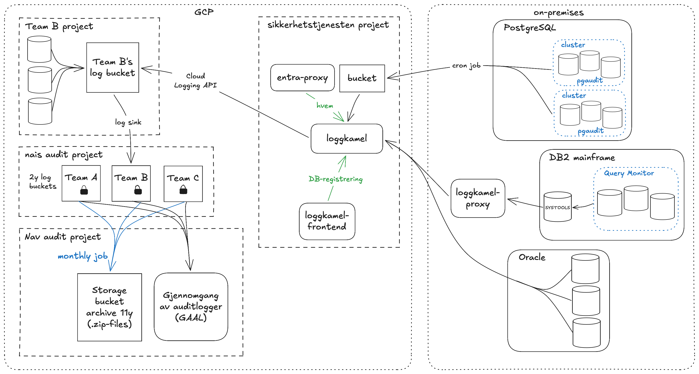

# Loggkamel

Loggkamel overfører logger fra on-prem databaser til GCP.

Slackkanal:
[#team-sikkerhetstjenesten](https://nav-it.slack.com/archives/C09KKNS0RJS)

## Program design and intent



## Usage (for other teams)

In order for Loggkamel to transfer/archive audit logs from an on-prem database to the Nais audit log archive, the following is required:
* For push model technologies: Database logs must be sent by DBAs to the appropriate destination bucket in GCP
  * PostgreSQL - Nothing required from registering team
* For pull model technologies: Loggkamel must have read access to the appropriate database(s)
  * DB2 - configured trough loggkamel-proxy, nothing required from registering team
  * Oracle - Not Yet Implemented
  * IMS - Not Yet Implemented
* A corresponding AuditloggTask must be configured via the frontend, at [loggkamel-frontend](https://github.com/navikt/loggkamel-frontend)
* The AuditloggTask must have at least one of the applicable flags be true:
  * okonomi for [økonomireglementet 4.3.6](https://www.regjeringen.no/globalassets/upload/fin/vedlegg/okstyring/reglement_for_okonomistyring_i_staten.pdf),
  * endringerUtenKrav for [arkivforskrifta §5](https://lovdata.no/nav/forskrift/2025-12-17-2647/) or if changes are desired for other reasons, and/or
  * loggingLeseoperasjoner if SELECT logs needs to be archived for e.g. personvernshensyn.
* The flag "fiksa" asserts whether all configuration needed is completed
  * Postgres and DB2 tasks will have this flag set to "true" by default, since no additional configuration is needed from project owners
  * For some pull model technologies this flag will be false initially, until configuration is done by that team to ensure loggkamel-proxy has read access to the DB files
    * Not applicable to any implemented technologies, expected to affect Oracle and IMS

### Swagger

DEV: https://loggkamel.intern.dev.nav.no/swagger-ui/index.html#/

PROD: https://loggkamel.intern.nav.no/swagger-ui/index.html#/

## Route Structure

TODO: update schemas with pull behavior creating packets instead of streams


### Ingress

For push-based technologies, DBAs will be responsible for pushing logs to the appropriate GCP bucket. For pull-based
technologies, Loggkamel will be responsible for pulling logs from the relevant database via loggkamel-proxy. In this step the logs are
decompressed if necessary, and represented as a String containing one or more log lines.

Consumers are configured to delete the source file from GCP only once processing is successful, whether that be moving forward
or sending a file to a backout queue. This enforces transactional behavior.

Consumers are configured to use an idempotent consumer pattern, to avoid multiple simultaneous processes when multiple instances
of Loggkamel are running in DEV or PROD. This behavior is implemented via a database table that tracks already processed files,
and is cleaned regularly to avoid unbounded growth.

Consumers are configured to use a feature flag, allowing for per-consumer control in DEV and PROD. Consumer routes start disabled
but will be enabled within a minute of startup if their flags are set to true. Log publishing is also flagged, for ease
of testing in DEV. This can be managed in [Unleash](https://sikkerhetstjenesten-unleash-web.iap.nav.cloud.nais.io).

#### Postgres

Push-based, we expect logs to be .gz files that are the output of pgAudit. Filenames are expected
to be of the form:

`<database_name>.<publish_date>.auditlog[.gz]`

DBAs send us all on-prem audit logs by default, so no configuration should be necessary at the team level. Let us know
if you expect to be seeing logs and aren't. Duplicate consumption is avoided via lock files in the `camel_messageprocessed`
table.

#### DB2

Pull-based. A scheduled task runs once a day and pulls logs for the two preceding days via loggkamel-proxy, writing them
directly as log packets to the log packet bucket. Logs are pulled for every Arkiv task where `teknologi` is DB2, `fiksa`
is true, `discard_logs` is false, and at least one archiving requirement flag is set.

The schedule fires on every instance, but only the instance that takes the PostgreSQL advisory lock performs the pull.
Controlled by the `pull-db2-logs` feature flag in [Unleash](https://sikkerhetstjenesten-unleash-web.iap.nav.cloud.nais.io).

#### Log Packets

Log packets have a standardized structure containing the original log as a message body and are consumed from the log packets bucket.
Duplicate consumption is 
avoided via lock files in the `camel_messageprocessed` table.

## Backout Queues

Log files that fail processing are sent to a technology-specific backout queue (for postgres logs) or to the log packet queue
(for others), so that they may be redriven by being moved back to the consumer directory.

## Graceful Termination

Graceful termination is handled by default Spring Boot behavior. On receiving a shutdown signal individual routes will
finish their current message processing before shutting down, and no new messages will be taken in. Messages are only
removed from the origin queue once processing is complete, so no messages will be lost if the service terminates before
finishing processing a message. If the service shuts down abruptly, the message will not be removed from the origin queue
and will be processed by another instance of loggkamel after the lock on it has expired. 
GCP log clients are flushed on shutdown to ensure that all messages are sent before the service exits.

## Kjøre lokalt (for development)

Applikasjonen er satt opp til a bruke en PostgreSQL proxy i `local`-profilen, det bruker den DEV Loggkamel DB.

### Kjøre lokal proxy mot dev DB (anbefalt)

Start your local database proxy with:

```zsh
nais postgres proxy --team sikkerhetstjenesten --environment dev-gcp --reason "debugging issue" loggkamel
```

### Log file input and output

For push-based technologies, files must be placed into resources/files/TECHNOLOGY directories for loggkamel to find them.
Intermediate LogPacket files will be placed in resources/files/intermediate. Invalid message queues are
represented by directories that are created under these consumer as needed. A log file can be redriven by being copied
back into the consumer directory, either technology-specific for LogStreams or "intermediate" for LogPackets. If redriving
a file multiple times in close succession, ensure that the file is removed from the camel_messageprocessed idempotent consumer
table so that it is not ignored by its consumer.

TODO: notice of chatbot usage

TODO: invitation to contribute (nominally open source)